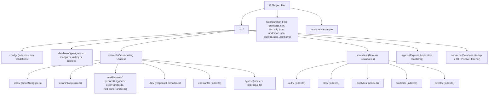
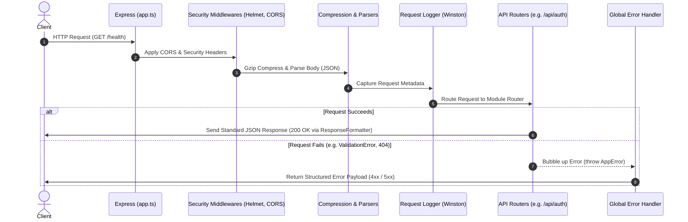
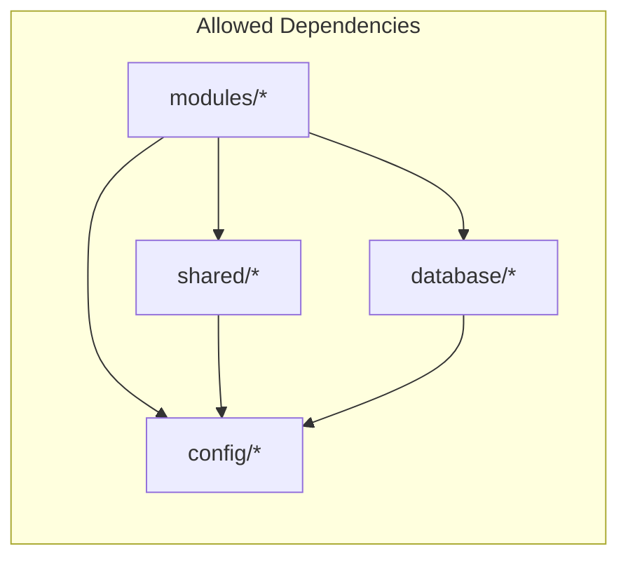

# File Analytics Platform - Architecture & Infrastructure Documentation

This document outlines the system architecture, directory structures, request routing lifecycles, and design patterns established for the **File Analytics Platform**. 

Originally built as a **Modular Monolith**, the system enforces strict boundaries between domain domains, ensuring it is ready for future **Microservices** migration.

---

## 1. Folder Structure Diagram

Below is the directory tree of the project. Notice the clean segregation of configurations, shared utilities, databases, and the feature-isolated `modules/` folder.



---

## 2. Request Flow Diagram

This diagram displays the execution pipeline for an incoming HTTP request as it traverses security layers, logging, parsing, routing, and error interceptors.



---

## 3. Layered Architecture Diagram

Each individual module follows Clean Architecture principles, enforcing unidirectional dependency flows from the outer HTTP interfaces down to the core databases.

```mermaid
graph TB
    subgraph Client Interface
        HTTP[Express Request / Routes]
    end

    subgraph Controllers
        CTRL[Controller Handlers - Validate req.body/params via Zod]
    end

    subgraph Service Layer (Business Logic)
        SERV[Domain Services - Pure business rules, isolated from HTTP]
    end

    subgraph Repository Layer (Data Access)
        REPO[Repositories - Construct Database queries]
    end

    subgraph Database Infrastructure
        DB_PG[PostgreSQL Pool]
        DB_MG[MongoDB / Mongoose]
        DB_VK[Valkey Client]
    end

    HTTP --> CTRL
    CTRL --> SERV
    SERV --> REPO
    REPO --> DB_PG
    REPO --> DB_MG
    REPO --> DB_VK

    classDef layer fill:#eef,stroke:#33f,stroke-width:2px;
    class HTTP,CTRL,SERV,REPO,DB_PG,DB_MG,DB_VK layer;
```

---

## 4. Dependency Flow Rules

To maintain high cohesion and low coupling in our Monolith, code dependencies must follow strict rules:
1. **Modules do not depend on each other directly**: If the `analytics` module requires information from the `files` module, it must go through a public service interface exported by `files/index.ts`. Deep imports (e.g. `import ... from 'modules/files/controllers/...'`) are banned.
2. **One-way configuration flow**: The configuration loader validates variables on boot. No file should modify config settings at runtime.
3. **Injectable Core Utilities**: Domain modules depend on `src/shared` (for logger, custom errors, and response formatters), but `src/shared` must *never* import anything from domain modules.



---

## 5. Future Microservice Migration Strategy

When traffic or complexity requires migrating a module (e.g., `analytics` or `workers`) into a microservice, follow this technical playbook:

### Step 1: Clone the Module Directory
Because the module folder (e.g., `src/modules/analytics`) is self-contained:
* Copy the directory `src/modules/analytics` into a new repository.

### Step 2: Establish the Microservice Wrapper
Initialize a minimal Express bootstrapper (`server.ts` & `app.ts`) inside the new repository, copying the project's base configuration files (`package.json`, `tsconfig.json`, `.eslintrc.json`):
```typescript
import express from 'express';
import helmet from 'helmet';
import { analyticsRouter } from './analytics/index'; // The module's entry router

const app = express();
app.use(helmet());
app.use(express.json());

// Mount the microservice's main router at root level
app.use('/api/analytics', analyticsRouter);

app.listen(3001, () => console.log('Analytics Microservice online on port 3001'));
```

### Step 3: Switch Database Connections
Configure the microservice to only connect to the database it operates. For example, if `analytics` operates on MongoDB:
* Maintain only `mongo.ts` inside the database connection loader in the new project.
* Remove `postgres.ts` and `valkey.ts` dependencies.

### Step 4: Swap In-Process Calls with Network APIs / Message Queues
* **Synchronous Communication**: If the monolith was calling `AuthService.validateToken()` in-memory, rewrite it in the monolith or API Gateway to route HTTP/gRPC requests to the new `auth` microservice.
* **Asynchronous Communication**: If the monolith was invoking files event handlers locally, introduce a message broker (e.g., Valkey Streams, RabbitMQ, or Kafka). The `files` service will publish a `file.uploaded` event, and the `analytics` microservice will subscribe and process it independently.

### Step 5: Route Traffic via API Gateway
Configure Nginx, Kong, or AWS API Gateway to route traffic:
* `/api/auth` -> Monolith (Port 3000)
* `/api/analytics` -> Analytics Microservice (Port 3001)
